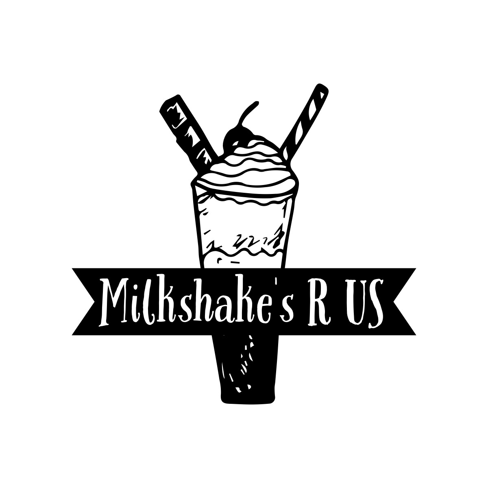

# MilkshakesRUs

## Milk Smoothie

We will have the user choose the flavors they like, based on their answers we will suggest a smoothie for them. We will show the picture and the price at the end.

This project will help us to learn in depth CSS and JS. If there is a worker shortage and customers need to order from a machine by themselves, but don’t know which one to try, our website will help them choose!

## Project Description and Problem Domain

*We have a vision to create a milkshake recommendation website that helps people discover and enjoy delicious milkshakes tailored to their personal taste preferences.  This addresses the pain point of people struggling to find milkshakes they enjoy, which can be frustrating and time-consuming.  Our website aims to provide a curated selection of milkshake options based on users’ preferences, making it easier for people to find and enjoy their perfect milkshake.* 

## MVP

>+ Working website
>+ Interactive image
>+ Minimum 4 options for users to choose.
>+ Including questions : none for an answer

## Potential Additional Features

>+ Calories calculated
>+ Picture tiles of toppings
>+ Price total calculated
>+ Implementation of ChatGPT

## Team Members

Jonathan Brooks  
Sarah Mahdi  
Zeegii Ulziibaatar 
Brendan Duffy

## Planning

+ a link to our [project managment board](https://app.asana.com/0/1204278230452331/board) over in Asana.

Here is our wireframe: 

Here is our Domain Model: 

## REFERENCES
<!-- [title](https://www.example.com) -->

### CSS

[Beautiful CSS Button Examples](https://getcssscan.com/css-buttons-examples)

### Accessibility

[Accessibility Best Practices for Logos](https://www.w3.org/WAI/tutorials/images/decorative/) 
[Accessibility Best Practices for Buttons](https://www.searchenginejournal.com/alt-text-for-logos-and-buttons/469801/#close) 
[Accessibility Best Practices for Headshots](https://sc.edu/about/offices_and_divisions/digital-accessibility/guides_tutorials/alternative_text/headshot-alt-text/index.php) 
[Accessibility Trouble Shooting Best Practices](https://www.expandtheroom.com/insights/how-to-check-web-accessibility-with-a-screen-reader-and-keyboard/) 
[Download NVDA Screen Reader](https://www.nvaccess.org/download/) 
[NVDA Keyboard Shortcuts Guide](https://dequeuniversity.com/screenreaders/nvda-keyboard-shortcuts) 
[Skip Navigation Links Tutorial](https://webaim.org/techniques/skipnav/) 
[CSS in Action: Invisible Content Just for Screen Reader Users](https://webaim.org/techniques/css/invisiblecontent/) 

## Support Software

[Asana](https://asana.com/) was used as our project management software to track tasks and keep everyone on the same page. 
[ChatGPT](https://chatgptonline.io/) was used to calculate the calories of the ingredients that we then used as input for our total calorie count calculations. 

## Gratitude

*A special thanks to all the TAs for their help and especially Stephanie Hill for her guidance and being SUPER PATIENT with all of our questions!* 

